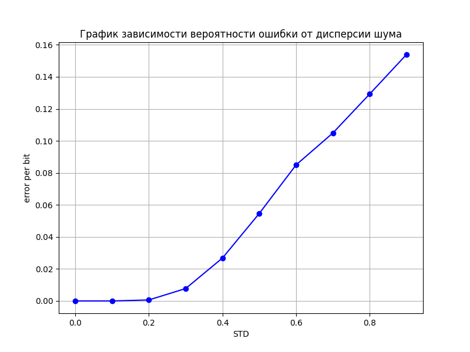

# Тестовое задание для стажировки в Yadro

## QAM модуляция

Программа для модуляции, зашумливания и демодуляции случайной двоичной последовательности
***main.cpp*** --- главный файл

Запуск:

Предварительно необходимо выбрать схему модуляции в фале config.txt
Список поддерживаемых схем модуляции:

- QPSK
- QAM16
- QAM64

```bash
cd ./TestTask
make
./test_task
python3 plot.py
```

## Результаты

***plot.py*** строит график зависимости вероятности ошибки на бит от дисперсии гауссовского шума, добавляемого к созвездию
Требуется matplotlib




